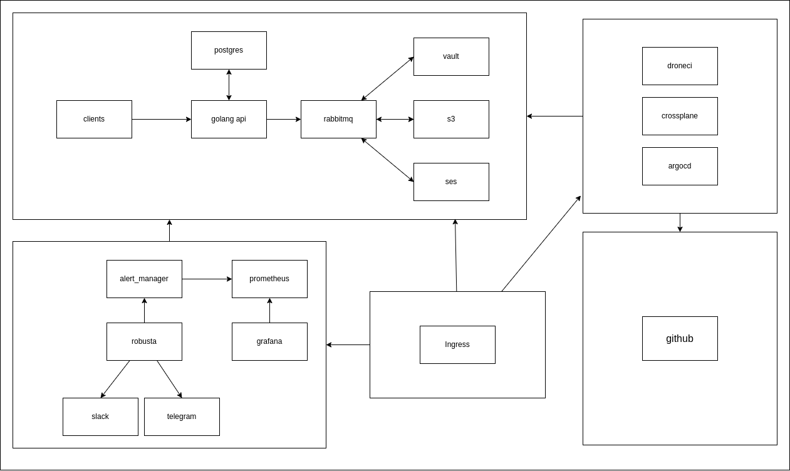

# Email Subscriber

---

Email marketing is one of the most cost-effective marketing strategy for small businesses. According to the Direct Marketing Association, email marketing on average sees a 4300 percent return on investment (ROI) for businesses in the United States.

## Contribua com esse Projeto <3

> ## Princípios

* Single Responsibility
* Open Closed
* Liskov Substitution
* Interface Segregation
* Dependency Inversion
* Separation of Concerns
* Don't Repeat Yourself
* You Aren't Gonna Need It
* Keep It Simple
* Composition Over Inheritance
* Small Commits

> ## Design Patterns

* Factory
* Adapter
* Composite
* Decorator
* Dependency Injection
* Abstract Server
* Proxy

> ## Metodologias e Designs

* Modular Design
* Dependency Diagrams
* Use Cases

> ## Bibliotecas e Ferramentas

* Golang
* Chi
* Git
* SQL
* RabbitMQ
* AWS-SDK
* viper
* UUID
* Postgres
* k8s
* Robusta
* CrossPlane
* ArgoCD
* Terraform
* DroneCI
* Helm
* Prometheus
* Grafana
* Ingress

> ## Features do Golang

* Strict Mode
* Interface
* TypeAlias
* Namespace
* Utility Types
* Modularização de Paths
* Configurações
* Build

> ## Features de Testes

* pending...
